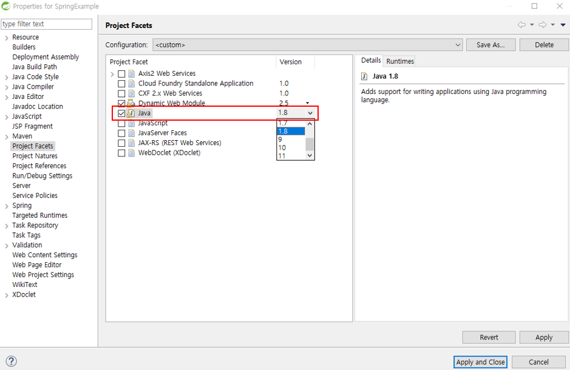

# SpringStudy(스프링 공부) 

`Program development environment` 
`Tomcat : 8.5.42` 
`STS : 3.9.8` 
`Spring : 4.3.24` 
`Usable DB : oracle, mysql, mssql, hana, (+ mongo?) ...etc` 
[마리아DB](https://downloads.mariadb.org/mariadb/+releases/)

## Spring MVC pattern

출처 : http://egloos.zum.com/springmvc/v/504151#type=comment&page=3

---

## 스프링 프로젝트 초기 설정

#### 1. 프로젝트 생성
* File - Spring Legacy Project
* Spring MVC Project 선택
* web.xml 한글 인코딩(UTF-8 Encoding)
~~~
<filter>
  <filter-name>encodingFilter</filter-name>
  <filter-class>org.springframework.web.filter.CharacterEncodingFilter</filter-class>
  <init-param>
    <param-name>encoding</param-name>
    <param-value>UTF-8</param-value>
  </init-param>
  <init-param>
    <param-name>forceEncoding</param-name>
    <param-value>true</param-value>
  </init-param>
</filter>
<filter-mapping>
  <filter-name>encodingFilter</filter-name>
  <url-pattern>/*</url-pattern>
</filter-mapping>
~~~

#### 2. pom.xml에서 JDK의 버전과 스프링 버전 수정
~~~
<properties>
  <java-version>1.8</java-version>
  <org.springframework-version>4.3.24.RELEASE</org.springframework-version>
  <org.aspectj-version>1.6.10</org.aspectj-version>
  <org.slf4j-version>1.6.6</org.slf4j-version>
</properties>
~~~

#### 3. 프로젝트의 Properties - Project Facts 에서 JDK 버전 설정

#### 4. pom.xml에 라이브러리 추가 (참고 : [Mavenrepository](https://mvnrepository.com/))
* Spring-test 모듈
~~~
<!-- https://mvnrepository.com/artifact/org.springframework/spring-test -->
<dependency>
    <groupId>org.springframework</groupId>
    <artifactId>spring-test</artifactId>
    <version>4.3.24.RELEASE</version>
    <scope>test</scope>
</dependency>
~~~
* Spring-jdbc 모듈
~~~
<!-- https://mvnrepository.com/artifact/org.springframework/spring-jdbc -->
<dependency>
    <groupId>org.springframework</groupId>
    <artifactId>spring-jdbc</artifactId>
    <version>4.3.24.RELEASE</version>
</dependency>
~~~
* SQL 드라이버(oracle, mysql, mssql, hana, (+ mongo?)) _개발환경에 맞춰서_
* MyBatis 모듈
~~~
<!-- https://mvnrepository.com/artifact/org.mybatis/mybatis -->
<dependency>
    <groupId>org.mybatis</groupId>
    <artifactId>mybatis</artifactId>
    <version>3.4.6</version>
</dependency>
~~~
* MyBatis-spring 모듈
~~~
<!-- https://mvnrepository.com/artifact/org.mybatis/mybatis-spring -->
<dependency>
    <groupId>org.mybatis</groupId>
    <artifactId>mybatis-spring</artifactId>
    <version>1.3.2</version>
</dependency>
~~~
* MyBatis 로그 모듈
~~~
<!-- https://mvnrepository.com/artifact/org.bgee.log4jdbc-log4j2/log4jdbc-log4j2-jdbc4 -->
<dependency>
    <groupId>org.bgee.log4jdbc-log4j2</groupId>
    <artifactId>log4jdbc-log4j2-jdbc4</artifactId>
    <version>1.16</version>
</dependency>
~~~
* DBCP 모듈
~~~
<!-- https://mvnrepository.com/artifact/commons-dbcp/commons-dbcp -->
<dependency>
    <groupId>commons-dbcp</groupId>
    <artifactId>commons-dbcp</artifactId>
    <version>1.4</version>
</dependency>
~~~

#### 5. pom.xml 에서 JUnit 버전과 Servlet 버전 변경
* Servlet 버전 변경
~~~
<!-- https://mvnrepository.com/artifact/javax.servlet/javax.servlet-api -->
<dependency>
    <groupId>javax.servlet</groupId>
    <artifactId>javax.servlet-api</artifactId>
    <version>3.1.0</version>
    <scope>provided</scope>
</dependency>
~~~
* JUnit 버전 변경
~~~
<!-- https://mvnrepository.com/artifact/junit/junit -->
<dependency>
    <groupId>junit</groupId>
    <artifactId>junit</artifactId>
    <version>4.12</version>
    <scope>test</scope>
</dependency>
~~~

#### 6. MyBatis log 및 config 파일
* dataSource 수정
~~~
<bean id="dataSource" class="org.springframework.jdbc.datasource.DriverManagerDataSource">
  <property name="driverClassName" value="net.sf.log4jdbc.sql.jdbcapi.DriverSpy"></property>
  <property name="url" value="jdbc:log4jdbc:sqlserver://주소:포트;"></property>
  <property name="username" value="user"></property>
  <property name="password" value="pw"></property>
</bean>
~~~
* log4jdbc.log4j2.properties 파일과 logback.xml 파일 추가

src/main/resource 경로에 log4jdbc.log4j2.properties 파일 생성
~~~
log4jdbc.spylogdelegator.name=net.sf.log4jdbc.log.slf4j.Slf4jSpyLogDelegator
log4jdbc.dump.sql.maxlinelength=0
~~~
* logback.xml 파일 생성
~~~
<?xml version="1.0" encoding="UTF-8"?>
<contiguration>
  <include resource="org/springframework/boot/logging/logback/base.xml" />
  
  <!-- log4jdbc-log4j2 -->
  <logger name="jdbc.sqlonly" level="DEBUG">
    <logger name="jdbc.sqltiming" level="INFO"/>
    <logger name="jdbc.audit" level="WARN"/>
    <logger name="jdbc.resultset" level="ERROR"/>
    <logger name="jdbc.resultsettable" level="ERROR"/>
    <logger name="jdbc.connection" level="INFO"/> </logger>
</contiguration>
~~~
